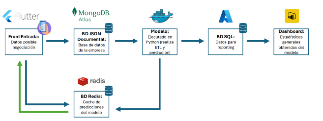
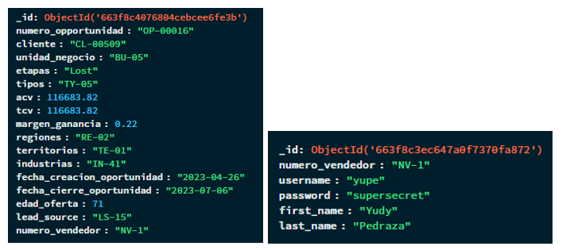

# Bases de Datos para la predicción de ventas

## 1. Introducción 

### Descripción del Proyecto 

Este proyecto implica el desarrollo de una arquitectura funcional que integra el uso de tres tipos de bases de datos, tanto relacionales como no relacionales, un modelo de machine learning, y un panel de visualización de datos. La finalidad de esta arquitectura es facilitar la captura de oportunidades de venta de una multinacional estadounidense de comunicaciones, a través de una interfaz de usuario diseñada para que los vendedores ingresen información relevante sobre oportunidades de negocio. Esta información capturada es almacenada en las bases de datos y utilizada para alimentar el modelo de machine learning encargado de realizar predicciones sobre dichas oportunidades de negocio identificadas, es decir, si se ganan o se pierden. 

 
### Contexto 

En el contexto de la predicción de ventas, identificar oportunidades de venta y almacenar estos datos es crucial. Las bases de datos no relacionales juegan un papel esencial en este proceso debido a su flexibilidad y escalabilidad, características que son importantes vitales para manejar grandes volúmenes de datos desestructurados o semi-estructurados generados por las interacciones de los vendedores en la interfaz de usuario. Al guardar esta información en bases de datos no relacionales, las empresas pueden capturar y analizar una amplia gama de datos de ventas en tiempo real, desde notas de interacciones hasta detalles específicos de las oportunidades de venta. Esta riqueza de datos permite alimentar con precisión los modelos de machine learning, mejorando significativamente la capacidad de prever tendencias de ventas futuras y facilitando decisiones estratégicas más informadas y oportunas. 

 

### Alcance 

El alcance de este proyecto académico es diseñar y desarrollar una arquitectura funcional que integre múltiples tecnologías, incluyendo bases de datos relacionales y no relacionales, un modelo de machine learning y herramientas de visualización de datos. Este proyecto se presentará en funcionamiento, mostrando la capacidad de la arquitectura para procesar y analizar datos en tiempo real, proporcionando insights valiosos y predicciones precisas. Cabe destacar que no se espera replicar, expandir ni llevar este proyecto a producción, ya que su propósito es netamente académico. Se busca que esta aplicación evidencie el dominio técnico de las herramientas y conceptos aprendidos en el curso y que ilustre el potencial práctico de estas tecnologías en escenarios comerciales simulados. 

## 2. Objetivos 

### Objetivo General 

Desarrollar una aplicación que integre tecnologías de bases de datos, machine learning y visualización de datos para analizar y predecir si las oportunidades de ventas se ganan o pierden, utilizando datos dummies de una compañía. 

### Objetivos Específicos 

Implementar y configurar tres tipos de bases de datos (relacionales, no relacionales) para gestionar eficientemente los datos recolectados a través de la interfaz de usuario, asegurando una base sólida y confiable para el análisis y la predicción. 

Desarrollar y entrenar un modelo de machine learning que utilice los datos almacenados para generar predicciones precisas sobre el resultado final de las oportunidades de venta, y presentar estos resultados a través de un panel de visualización de datos que facilite la interpretación. 

## 3. Atributos de Calidad 

**Escalabilidad:** La arquitectura del proyecto está diseñada para ser escalable, permitiendo el manejo de un mayor volumen de datos y usuarios sin comprometer el rendimiento. Utilizando MongoDB Atlas para la base de datos documental y Redis para la caché, se facilita la escalabilidad horizontal. Además, los servicios desplegados en Docker pueden ser escalados fácilmente al añadir más contenedores. 

**Rendimiento:** El proyecto emplea Redis como una caché de alta velocidad para almacenar las predicciones del modelo, lo que mejora significativamente el tiempo de respuesta. Python se utiliza para el procesamiento ETL y la ejecución del modelo, aprovechando bibliotecas optimizadas para manejar grandes volúmenes de datos de manera eficiente. 

**Disponibilidad:** La disponibilidad del sistema se asegura mediante el uso de servicios en la nube como MongoDB Atlas y el despliegue en contenedores Docker, que ofrecen alta disponibilidad y redundancia. Los datos críticos se almacenan en bases de datos SQL para reporting, garantizando que siempre haya acceso a los datos importantes. 

**Seguridad:** La seguridad se implementa a través de prácticas recomendadas de manejo de datos y autenticación segura en todas las interacciones del sistema. Las bases de datos y servicios como MongoDB Atlas, y Redis incluyen medidas de seguridad robustas como cifrado de datos y autenticación. 

**Mantenibilidad:** El uso de Docker facilita la mantenibilidad al permitir el despliegue de entornos consistentes y aislados. Los scripts en Python están bien documentados y estructurados, lo que facilita la actualización y modificación del código. El uso de Power BI para la visualización permite una fácil actualización de informes sin cambios significativos en el backend. 

**Confiabilidad:** La confiabilidad del sistema se asegura mediante el uso de bases de datos robustas como PostgreSQL y MongoDB Atlas, así como el almacenamiento en caché con Redis. Las pruebas exhaustivas del modelo predictivo en Python aseguran que las predicciones sean precisas y confiables. La integración de todas las partes del sistema se realiza de manera que cualquier falla sea rápidamente identificada y corregida. 

## 4. Descripción de la Arquitectura 

### Diagrama de Arquitectura 

La arquitectura mostrada en la imagen es un sistema integrado para la recolección, procesamiento y visualización de datos, diseñado para manejar y analizar información de oportunidades de negocio.  

### Componentes 

**Front Entrada (Flutter):** Es la interfaz de usuario desarrollada con Flutter, donde se ingresan los datos de posibles negociaciones. Esta interfaz es el punto de entrada para los datos que serán procesados y analizados. 

**BD JSON - MongoDB Atlas:** Los datos ingresados a través de la interfaz de usuario son almacenados en MongoDB Atlas, una base de datos NoSQL que utiliza un formato JSON documental. Esta base de datos se encarga de manejar los datos desestructurados de la empresa. 

**Modelo (Python):** Un modelo de machine learning ejecutado en Python que realiza procesos ETL (Extract, Transform, Load) y predicciones. Este modelo toma los datos de MongoDB, los procesa y genera predicciones. 

**BD SQL:** Los datos procesados y las predicciones generadas por el modelo en Python son almacenados en una base de datos SQL, que es utilizada para operaciones de reporting y análisis estructurado. 

**Dashboard (Power BI):** Un panel de control que muestra estadísticas generales y resultados obtenidos del modelo de predicción. Este dashboard facilita la visualización y el análisis de los datos. 

**BD Redis:** Actúa como un caché para las predicciones del modelo. Al ser una base de datos en memoria que ofrece alta velocidad en el acceso a datos, permite almacenar y recuperar rápidamente las predicciones que son consultadas frecuentemente por el sistema o los usuarios. 

## Flujo de Datos 

Los datos fluyen principalmente desde la interfaz de usuario hacia MongoDB, luego hacia el modelo en Python, y finalmente a la base de datos SQL y el dashboard. Redis interactúa directamente con el modelo para almacenar y proporcionar acceso rápido a las predicciones. Además, existe un flujo directo entre el front de entrada y Redis para actualizar o recuperar predicciones de manera eficiente.

- Las siguientes son las estructuras de datos que recibe MongoDB desde la interfaz de usuario, dichas estructuras están en formato JSON. 

- El modelo hala la información de estas estructuras almacenadas en MongoDB para realizar el entrenamiento y predicción del resultado de las oportunidades de venta. El modelo es un Random Forest, al que se le aplica una búsqueda de hiperparámetros para encontrar la combinación más eficiente, iterando el número de árboles y la profundidad de estos.
- El resultado del modelo se guarda junto a las variables iniciales en la base de datos de SQL Server y es enviada al Redis que funciona como caché.
- La base de datos de SQL es leída desde Power BI junto con la base de datos de los vendedores, que también fue guardada allí, dichas bases siempre van a contener las mismas columnas. A continuación, se muestra el diagrama de entidad relación visualizado en Power BI.

En el siguiente proyecto se presentará una solución para la implementación de un algoritmo de Machine Learning utilizando diversas bases de datos como `mongodb`, `redis` y `sql`.

Para poder ejecutar este proyecto se ha generado un `README` tanto para el `backend` como para el `frontend`.

El orden en el cual debe ser ejecutado este proyecto para evitar inocnvenientes es:

1. Correr todo el `backend`
2. Correr todo el `frontend`