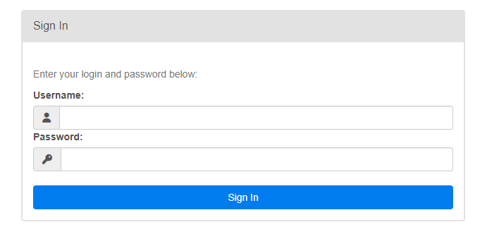
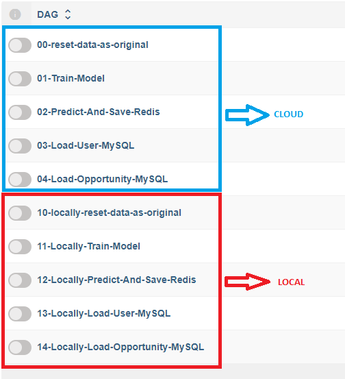

# BACKEND - HOW TO USE

En las siguientes líneas se explicará cómo poder usar el backend

1. Abrir el repo en _Visual Studio Code (VSCode)._
2. Abre una nueva teerminal en el foler actual
3. Dirígete al `backend`. Para hacerlo corre lo siguiente en tu terminal `cd backend`
4. Crea el archivo `.env` con la instancia de **Airflow**

```bash
echo -e "AIRFLOW_UID=$(id -u)" > .env
```

5. Agrega el resto de variables necesarias en el `.env`. Las variables servirán para esta sección del `docker-compose`

```yaml
# Valores propios
MONGODB_USER: ${MONGODB_USER}
MONGODB_PASSWORD: ${MONGODB_PASSWORD}
MONGODB_SERVER: ${MONGODB_SERVER}
REDIS_HOST: ${REDIS_HOST}
REDIS_PORT: ${REDIS_PORT}
REDIS_PASSWORD: ${REDIS_PASSWORD}
SQL_USER: ${SQL_USER}
SQL_PASSWORD: ${SQL_PASSWORD}
SQL_HOST: ${SQL_HOST}
SQL_PORT: ${SQL_PORT}
SQL_DATABASE: ${SQL_DATABASE}
```

También servirá para la sección `code-not-automated`

6. Construir las imágenes de docker.

```bash
docker-compose up airflow-init
docker-compose up
```

7. Espera hasta que todas las imágenes carguen (toma un tiempo)

8. `SOLO LINUX/UNIX` Una vez carguen las imagenes debes correr la siguiente línea de código en una **nueva terminal**

```bash
cd backend
ls -la .
```

Si todo te sale con tu nombre de usuario, no se deben hacer pasos adicionales, de lo contrario si sale algo parecido a esto:

```
drwxr-xr-x 5 candemas97 candemas97  4096 May 11 10:15 .
drwxr-xr-x 5 candemas97 candemas97  4096 May 11 10:08 ..
-rw-r--r-- 1 candemas97 candemas97   326 May 11 10:15 .env
-rw-r--r-- 1 candemas97 candemas97  3086 May 11 10:08 .gitignore
-rw-r--r-- 1 candemas97 candemas97    10 May 11 10:08 README.md
drwxr-xr-x 2 candemas97 candemas97  4096 May 11 10:08 data
drwxr-xr-x 5 candemas97 candemas97  4096 May 11 10:11 docker
-rw-r--r-- 1 candemas97 candemas97 12031 May 11 10:08 docker-compose.yaml
drwxr-xr-x 2 root       root        4096 May 11 10:11 model
```

Donde hay un valor `root` en lugar de `candemas97` debemos modificar la ruta. Para tal motivo se debe realizar lo sigiuente:

```bash
sudo chown -R [usuario]:[usuario] /ruta/a/tu/carpeta
```

En este caso específico sería así

```bash
sudo chown -R candemas97:candemas97 ./model
```

Se ejecuta nuevamente la línea de comando

```bash
ls -la .
```

Y todo debería quedar para el usuario en cuestión, en mi caso:

```
drwxr-xr-x 5 candemas97 candemas97  4096 May 11 10:15 .
drwxr-xr-x 5 candemas97 candemas97  4096 May 11 10:08 ..
-rw-r--r-- 1 candemas97 candemas97   326 May 11 10:15 .env
-rw-r--r-- 1 candemas97 candemas97  3086 May 11 10:08 .gitignore
-rw-r--r-- 1 candemas97 candemas97    10 May 11 10:08 README.md
drwxr-xr-x 2 candemas97 candemas97  4096 May 11 10:08 data
drwxr-xr-x 5 candemas97 candemas97  4096 May 11 10:11 docker
-rw-r--r-- 1 candemas97 candemas97 12031 May 11 10:08 docker-compose.yaml
drwxr-xr-x 2 candemas97 candemas97  4096 May 11 10:11 model
```
> [!WARNING]
> 
> Si esto no es realizado el código generará error por falta de permisos en las carpetas

8. Una vez cargue y si estabas en Linux terminas el proceso anterior, dirígete en tu **explorador** al `localhost:8080`. Deberás ver la siguiente pantalla:



9. La clave y contraseña a ser ingresada debe ser:

```
Username: airflow
Password: airflow
```

10. Por último para correr cada instancia, sólo debes presionar el botón a mano izquiera, recuerda que debes hacerlo en el orden mencionado y esperar a que acabe cada ejecución para empezar con la otra (paso `00-reset-data-as-original` no es obligatorio, los otros pasos sí en el orden indicado).

