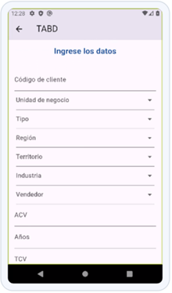

# Aplicativo

## Importante:

Si se quiere correr desde el código fuente, por favor dirigirse a la carpeta **myapp-main** y seguir los pasos. De lo contrario seguir los siguientes pasos

## Aplicación dentro de APK

El archivo APK será enviado por otro medio, pues por el tamaño de este no permite ser cargado en GitHub.

## Instalación

1. **Instalar el apk**:

   - Instala el apk suministrado en cualquier dispositivo con sistema operativo Android

2. **Permisos**:
   - Acepta los permisos requiridos para la aplicación (si son solicitados).

## Uso

1. **Inicio de Sesión**: Inicia la aplicación e inicia sesión con tu correo electrónico y contraseña.
   - **Usuario:** morenoluis@javeriana.edu.co
   - **Contraseña:** Admin123

2. **Captura de Datos**: Navega a la pantalla de captura de datos e ingresa la información requerida para una oportunidad comercial. Guarda los datos.

3. **Validación de Propuestas**: Navega a la pantalla de validación de propuestas, ingresa el número de la propuesta y verifica su estado.

